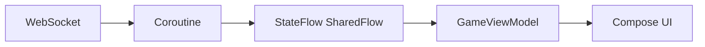
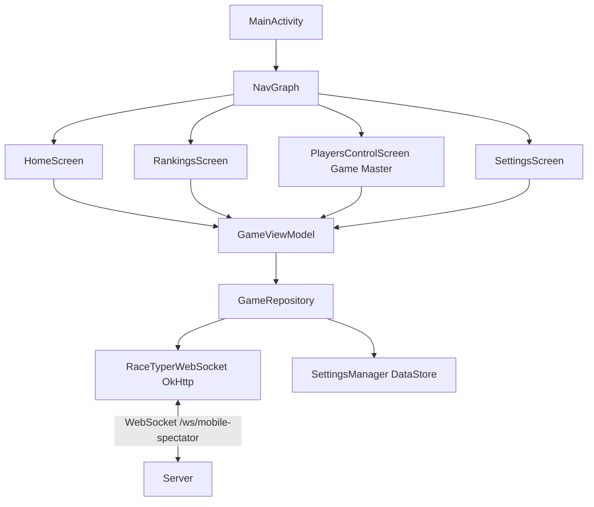
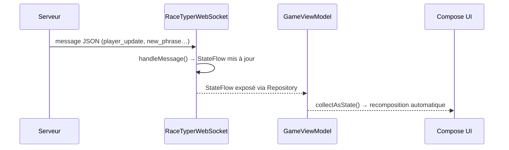
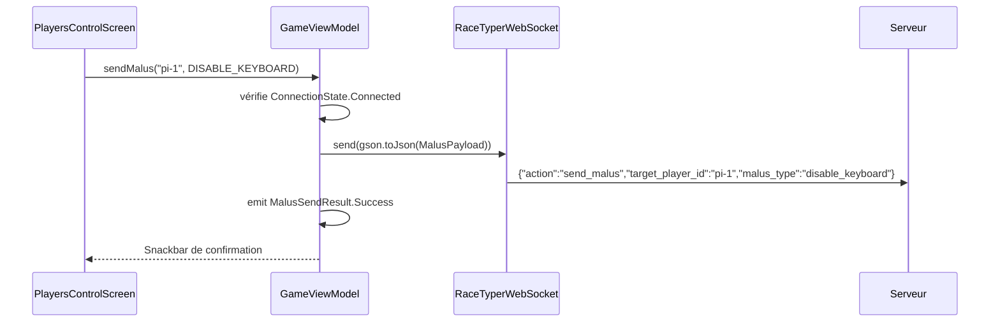

# Pôle 4 – Application Mobile (Android)

Application Android permettant de suivre une partie RaceTyper en temps réel et d'interagir avec les joueurs depuis le rôle de Game Master.

## Rôle dans le projet

L'application couvre deux fonctions distinctes sur la même connexion WebSocket :

- **Spectateur** : reçoit les événements de jeu poussés par le serveur (scores, manches, classement) et les affiche en continu.
- **Game Master** : envoie des malus ciblés aux joueurs en course pour perturber leur session.

## Éléments mis en place

### Connexion WebSocket comme spectateur

L'application se connecte en tant que `mobile-spectator` sur l'endpoint `/ws/mobile-spectator`. Cet identifiant permet au serveur de distinguer les consoles de jeu des simples observateurs.

La connexion est gérée par `RaceTyperWebSocket`, avec reconnexion automatique à backoff exponentiel (de 1 s à 30 s). La méthode `send()` permet l'envoi bidirectionnel sur cette même connexion.

### Interface Game Master

Un écran dédié `PlayersControlScreen` liste les joueurs actifs en cours de partie. Pour chaque joueur, trois malus sont proposés :

| Malus | Effet |
|---|---|
| `intrusive_gif` | Affiche un GIF plein écran sur la borne pendant 3 s |
| `disable_keyboard` | Bloque le clavier physique du joueur pendant 1 s |
| `physical_distraction` | Déclenche la sirène et les LEDs de la Raspberry Pi via GPIO |

Le filtre des joueurs affichés exclut automatiquement les bots et les spectateurs via `getActivePlayersForControl()`. Un feedback visuel (Snackbar) confirme chaque envoi ou signale une erreur.

### Modèles de données

`Models.kt` contient l'enum `MalusType` — chaque entrée porte son `key` JSON, un label affiché et une description — ainsi que `MalusPayload`, le DTO sérialisé envoyé au serveur :

```json
{ "action": "send_malus", "target_player_id": "pi-1", "malus_type": "disable_keyboard" }
```

### Feedback et gestion d'erreurs

`MalusSendResult` est une sealed class (Success / Failure) émise via un `SharedFlow` dans le ViewModel. L'UI la collecte avec `LaunchedEffect` pour afficher la Snackbar sans rejouer l'événement à chaque recomposition.

## Problèmes rencontrés et solutions

### L'app bloquait les manches côté serveur

**Problème** : le serveur attendait la fin de round en comptant `len(active_players)`. L'app mobile, connectée comme un joueur ordinaire, était incluse dans ce décompte. Une manche ne pouvait pas se terminer tant que l'app n'envoyait pas de résultat.

**Solution** : le serveur distingue maintenant les clients par leur identifiant. Tout client dont l'ID commence par `mobile` ou contient `-spectator` est placé dans un dictionnaire `spectators` séparé. Les spectateurs reçoivent les broadcasts mais ne sont pas comptabilisés dans les résultats de manche.

### Choix du canal pour les malus UI

**Problème initial** : la première implémentation routait tous les malus via MQTT. Pour les malus d'interface (`intrusive_gif`, `disable_keyboard`), cela imposait un bridge WebSocket local sur chaque Pi pour relayer le message au frontend React — une dépendance et un port supplémentaire sur chaque console.

**Solution retenue** : le serveur envoie directement les malus UI via le WebSocket existant vers la console Pi cible. MQTT est conservé uniquement pour `physical_distraction`, qui doit déclencher du matériel (GPIO). Résultat : les malus UI n'ont aucune dépendance au broker MQTT, et le `client_id` du Pi reste la seule source de vérité — aucune variable `CONSOLE_ID` supplémentaire à synchroniser.

## Choix de conception

### Une seule connexion WebSocket pour recevoir et envoyer

L'app utilise une unique connexion pour recevoir les événements et envoyer les malus. Créer une connexion dédiée pour l'envoi aurait complexifié la gestion des états de connexion et doublé la logique de reconnexion.

### StateFlow pour l'état durable, SharedFlow pour les événements ponctuels

Les états persistants (scores, liste de joueurs, statut) utilisent `StateFlow` : l'UI retrouve la dernière valeur à tout moment, même après une recomposition.

Les événements ponctuels (feedback malus, messages admin, kick) utilisent `SharedFlow` avec buffer. Un `StateFlow` aurait rejoué le dernier événement à chaque nouveau collecteur, ce qui provoquerait des Snackbars fantômes ou des alertes dupliquées.

### ViewModel partagé entre tous les écrans

Un seul `GameViewModel` est partagé via `viewModels()` dans `MainActivity`. La connexion WebSocket reste ainsi active quelle que soit la navigation entre les onglets — cohérent avec un rôle de spectateur où les mises à jour doivent continuer en arrière-plan.

### Coroutines (explication orale)

L'application utilise les coroutines Kotlin pour exécuter les traitements asynchrones sans bloquer l'interface. Concrètement, les messages réseau sont traités en arrière-plan, puis propagés au `ViewModel` via des `Flow`, et l'UI Compose se met à jour automatiquement.



## Architecture



L'application est organisée en couches, chacune ayant une responsabilité unique.

**Couche UI** — `MainActivity` instancie le `NavGraph` qui gère la navigation entre les quatre écrans. Chaque écran est un composable Compose sans logique métier propre : il observe des états et délègue les actions au ViewModel.

**Couche ViewModel** — `GameViewModel` est créé une seule fois dans `MainActivity` et partagé entre tous les écrans via `viewModels()`. Il reste donc en vie pendant toute la session, même quand l'utilisateur change d'onglet. C'est lui qui vérifie l'état de connexion avant d'autoriser un envoi de malus, et qui convertit les résultats bruts en événements consommables par l'UI.

**Couche Repository** — `GameRepository` est la seule source de vérité. Il ne fait pas de logique : il expose directement les `StateFlow` du WebSocket et fournit `sendMalus()` qui sérialise le payload JSON et l'envoie via `RaceTyperWebSocket.send()`.

**Couche réseau** — `RaceTyperWebSocket` gère la connexion OkHttp, le parsing des messages entrants, la reconnexion automatique et l'envoi sortant. C'est la seule classe qui touche au réseau.

**Persistance** — `SettingsManager` utilise DataStore pour sauvegarder uniquement l'URL du serveur. Il est complètement indépendant du WebSocket : une URL peut être modifiée dans les paramètres sans couper la connexion en cours.

### Flux de données entrant



Le serveur pousse des messages JSON en continu. `RaceTyperWebSocket` les parse et met à jour les `StateFlow` correspondants. Compose observe ces flows via `collectAsState()` : dès qu'une valeur change, seuls les composants concernés sont recomposés, sans action manuelle dans l'UI.

### Flux d'envoi d'un malus



Avant d'envoyer, le ViewModel vérifie que l'état de connexion est `Connected`. Si ce n'est pas le cas, un `MalusSendResult.Failure` est émis directement sans toucher au WebSocket. En cas d'envoi réussi, la confirmation (`Success`) transite par un `SharedFlow` collecté via `LaunchedEffect` dans l'UI — ce qui garantit que la Snackbar ne s'affiche qu'une seule fois même si l'écran est recomposé.

## Structure du code

```
app/src/main/java/com/example/racetyper/
├── MainActivity.kt
├── data/
│   ├── SettingsManager.kt          
│   ├── model/
│   │   └── Models.kt               
│   ├── repository/
│   │   └── GameRepository.kt       
│   └── websocket/
│       └── RaceTyperWebSocket.kt   
└── ui/
    ├── components/
    │   ├── CommonUi.kt
    │   ├── ConnectionStatus.kt
    │   ├── PlayerCard.kt
    │   └── ScoreBoard.kt
    ├── navigation/
    │   └── NavGraph.kt
    ├── screens/
    │   ├── HomeScreen.kt
    │   ├── RankingsScreen.kt
    │   ├── PlayersControlScreen.kt 
    │   └── SettingsScreen.kt
    ├── theme/
    │   ├── Color.kt
    │   ├── Theme.kt
    │   └── Type.kt
    └── viewmodel/
        └── GameViewModel.kt
```

## Messages WebSocket

Messages reçus du serveur :

| Type | Effet |
|---|---|
| `connection_accepted` | Confirmation de connexion |
| `game_status` | Statut global (waiting, playing, paused…) |
| `player_update` | Scores et liste des joueurs |
| `new_phrase` | Nouvelle phrase et numéro de manche |
| `round_classement` | Résultats de fin de manche |
| `game_over` | Scores finaux |
| `game_paused` / `game_reset` | Pause ou réinitialisation |
| `state_update` | Synchronisation complète |
| `round_wait` | Attente des autres joueurs |
| `admin_message` | Message texte de l'administrateur |
| `kicked` | Expulsion, reconnexion arrêtée |

Message envoyé au serveur :

| Type | Payload |
|---|---|
| `send_malus` | `{"action":"send_malus","target_player_id":"<id>","malus_type":"<type>"}` |

## Installation

L'application nécessite Android Studio, un appareil ou émulateur API 24 minimum, et le serveur (Pôle 2) accessible sur le réseau.

1. Ouvrir le dossier `4-MobileApp` dans Android Studio.
2. Laisser Gradle se synchroniser.
3. Lancer sur un appareil physique ou un émulateur.

Par défaut, l'app tente de se connecter à `192.168.1.100:8000`. L'adresse est modifiable dans l'onglet Paramètres et persistée sur l'appareil.

## État des fonctionnalités

| Fonctionnalité | Statut |
|---|---|
| Connexion WebSocket | Opérationnel |
| Reconnexion automatique | Opérationnel |
| Statut de la partie en direct | Opérationnel |
| Scores en temps réel | Opérationnel |
| Classement avec podium | Opérationnel |
| Phrase en cours | Opérationnel |
| Indicateur de connexion (LIVE/OFF) | Opérationnel |
| Configuration du serveur persistante | Opérationnel |
| Gestion des événements (pause, kick, admin) | Opérationnel |
| Thème sombre | Opérationnel |
| Envoi de malus (Game Master) | Opérationnel |
| Historique des parties (API REST) | Prévu — modèles prêts |
