# RaceTyper — Architecture & Fonctionnement

> Projet SAE BUT 3 — Jeu de frappe multi-joueurs en temps réel avec IA, GPIO, et application mobile.

---

## Table des matières

1. [Vue d'ensemble](#1-vue-densemble)
2. [Architecture globale](#2-architecture-globale)
3. [Composants détaillés](#3-composants-détaillés)
4. [Protocoles de communication](#4-protocoles-de-communication)
5. [Flux de jeu complet](#5-flux-de-jeu-complet)
6. [Base de données](#6-base-de-données)
7. [Système Bonus/Malus](#7-système-bonusmalus)
8. [IA (moteur PPO)](#8-ia-moteur-ppo)
9. [Déploiement](#9-déploiement)

---

## 1. Vue d'ensemble

RaceTyper est un système distribué de jeu de frappe compétitif pour **3-4 joueurs**. Chaque joueur tape des phrases sur une **console Raspberry Pi** ; un **serveur central** orchestre les parties, calcule les scores, et envoie des effets bonus/malus. Une **application Android** permet de suivre les scores en temps réel, et une **IA entraînée par PPO** peut participer comme adversaire.

### Technologies utilisées

| Couche | Technologie | Langage | Port |
|--------|-------------|---------|------|
| Serveur arbitre | FastAPI + PostgreSQL | Python 3.10 | 8080 |
| Frontend console | React + Vite | TypeScript | 5173 |
| Service GPIO | FastAPI | Python 3.10 | 5001 |
| Application mobile | Jetpack Compose | Kotlin 2.0 | APK |
| Moteur IA | PPO + Gymnasium | Python 3.10 | 8000 |
| Broker MQTT | Paho MQTT | — | 1883 |
| Base de données | PostgreSQL 16 | SQL | 5434 |

---

## 2. Architecture globale

> **Sources :** `2-ServerArbiter/server_app/app.py`, `mqtt_bridge.py`, `1-ConsoleRasberry/gpio-service/main.py`, `1-ConsoleRasberry/typing-game-frontend/src/hooks/useServerConnection.ts`, `4-MobileApp/.../RaceTyperWebSocket.kt`, `docker-compose.yml`

Ce diagramme représente la **vue macro du système distribué**. Le cœur est le **Server Arbitre** (FastAPI sur le port 8080) qui reçoit les connexions WebSocket de toutes les consoles Pi et de l'app mobile. Sur chaque Raspberry Pi cohabitent deux processus : le **frontend React** (interface de frappe, port 5173) et le **service GPIO** (contrôle physique de la sirène et des LEDs, port 5001). Quand le serveur veut déclencher un effet physique sur une console précise, il passe par le **broker MQTT** (port 1883) plutôt qu'en WebSocket — ce choix est visible dans `mqtt_bridge.py` qui utilise `paho-mqtt` en mode publish/subscribe. La **base de données PostgreSQL** tourne dans un conteneur Docker séparé (port 5434). Le **moteur IA** est un serveur d'inférence indépendant que le `GameManager` interroge en HTTP pour obtenir le prochain caractère prédit par le modèle PPO.

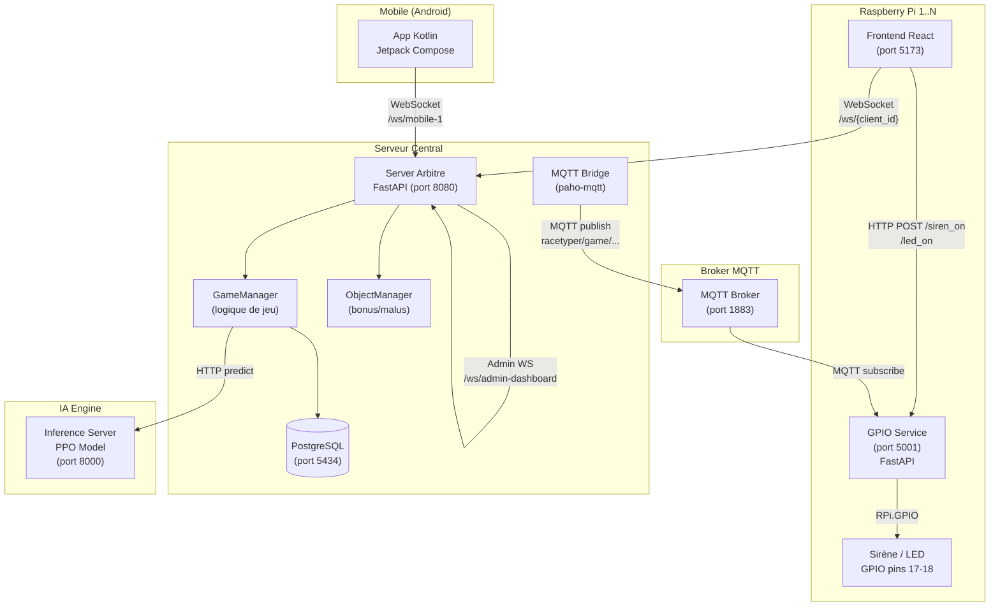

---

## 3. Composants détaillés

### 3.1 Server Arbitre (`2-ServerArbiter/`)

> **Sources :** `2-ServerArbiter/server_app/app.py`, `GameManager.py`, `ObjectManager.py`, `mqtt_bridge.py`, `database.py`

Ce diagramme de classes montre la **structure interne du serveur**. `FastAPI` expose les routes HTTP et WebSocket ; il délègue immédiatement la logique métier à `GameManager`. C'est `GameManager` (72 Ko, le fichier le plus dense du projet) qui contient toute la mécanique de jeu : il maintient un dictionnaire des joueurs connectés, leur score, l'index de la phrase courante et le statut de la partie. Il fait appel à `ObjectManager` pour savoir si un mot est marqué bonus/malus, à `MQTTBridge` pour envoyer des effets physiques sur les Pi, et à `Database` pour persister les résultats. `Database` est lui-même une couche d'abstraction qui bascule automatiquement entre `asyncpg` (driver rapide) et `pg8000` (fallback pur Python) selon la disponibilité de l'environnement.

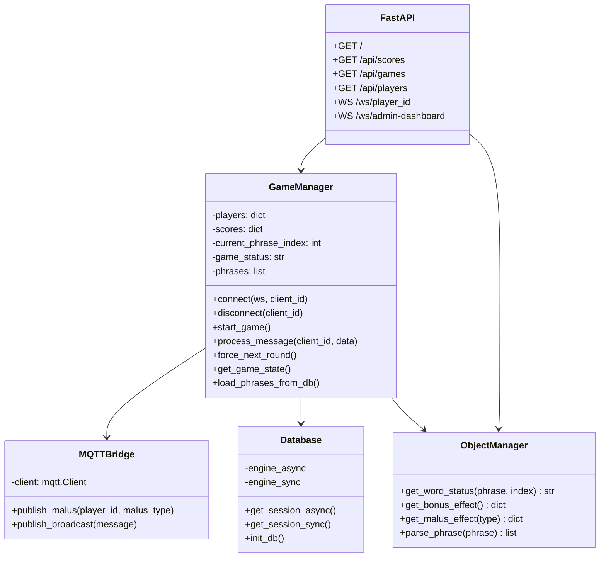

### 3.2 Frontend Console (`1-ConsoleRasberry/typing-game-frontend/`)

> **Sources :** `src/App.tsx`, `src/hooks/useServerConnection.ts`, `src/hooks/useTypingGame.ts`, `src/hooks/useAIOpponent.ts`, `src/components/TypingDisplay.tsx`, `src/components/MalusOverlay.tsx`

Ce diagramme montre l'**architecture React du frontend** tournant sur chaque Raspberry Pi. `App.tsx` est le composant racine qui gère l'état global (phase de jeu, scores, phrase en cours). Il s'appuie sur des **hooks personnalisés** pour séparer les responsabilités : `useServerConnection` gère exclusivement la connexion WebSocket et parse les messages entrants depuis le serveur ; `useTypingGame` encapsule toute la logique de validation mot par mot (préfixe verrouillé, comptage d'erreurs, détection des mots bonus/malus) ; `useAIOpponent` simule un adversaire local quand on joue en solo. Les composants visuels (`TypingDisplay`, `ProgressBar`, `GameStats`, `MalusOverlay`) sont purement présentationnels et reçoivent leurs données via les props d'`App.tsx`. Quand `useTypingGame` détecte la fin d'une phrase, il remonte les stats à `useServerConnection` qui envoie le message `phrase_finished` au serveur.

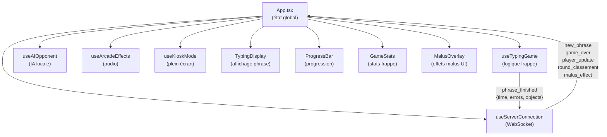

### 3.3 Application Mobile (`4-MobileApp/`)

> **Sources :** `app/src/main/java/com/example/racetyper/MainActivity.kt`, `ui/navigation/NavGraph.kt`, `ui/viewmodel/GameViewModel.kt`, `data/repository/GameRepository.kt`, `data/websocket/RaceTyperWebSocket.kt`, `data/SettingsManager.kt`

Ce diagramme représente l'**architecture MVVM de l'application Android**. L'entrée est `MainActivity` qui instancie le `NavGraph` Jetpack Compose pour la navigation entre écrans. La couche données est organisée en trois niveaux : `RaceTyperWebSocket` (OkHttp) gère la connexion brute au serveur ; `GameRepository` reçoit les messages parsés et les expose via des `StateFlow` Kotlin ; `GameViewModel` collecte ces flows et expose des états UI observables par les composables. `SettingsManager` utilise DataStore pour persister l'URL du serveur entre les sessions, avec une valeur par défaut `192.168.1.100:8000`. L'app est en lecture seule — elle consomme les events du serveur (scores, classement, fin de partie) sans envoyer de frappe.

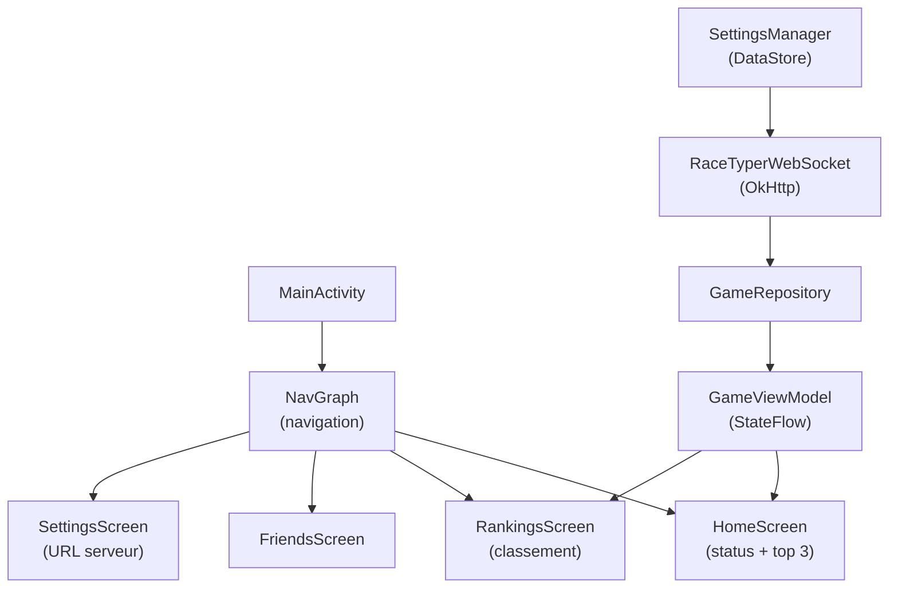

### 3.4 GPIO Service (`1-ConsoleRasberry/gpio-service/`)

> **Sources :** `1-ConsoleRasberry/gpio-service/main.py`, `malus_handler.py`

Ce diagramme de séquence montre le **chemin complet d'un malus physique**, de sa publication MQTT jusqu'au déclenchement matériel. `malus_handler.py` est le pivot : il s'abonne au topic MQTT `racetyper/game/console/{id}/malus` et, selon le type de malus reçu, prend deux chemins différents. Pour `physical_distraction`, il appelle en HTTP `POST /siren_on` sur `main.py` qui active la broche GPIO 18 (sirène) pendant 2 secondes puis la coupe — avec une simulation console quand `RPi.GPIO` n'est pas disponible (développement hors Pi). Pour les malus visuels (`intrusive_gif`, `disable_keyboard`), `malus_handler.py` maintient une liste de clients WebSocket frontend enregistrés et leur retransmet l'effet directement, sans passer par le serveur central — ce qui explique le double canal de communication sur chaque Pi.

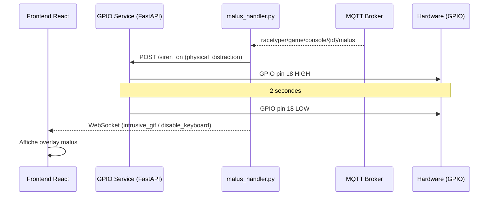

---

## 4. Protocoles de communication

### 4.1 WebSocket — Messages Serveur → Client

> **Sources :** `2-ServerArbiter/server_app/GameManager.py`, `app.py`, `1-ConsoleRasberry/typing-game-frontend/src/hooks/useServerConnection.ts`, `4-MobileApp/.../RaceTyperWebSocket.kt`

Ce diagramme liste tous les **types de messages que le serveur envoie aux clients** (Pi et mobile). Le flux normal d'une partie suit cet ordre : `connection_accepted` → `game_status` (waiting) → `new_phrase` → `round_wait` (dès qu'un joueur finit) → `round_classement` (quand tous ont fini) → retour `new_phrase` ou `game_over`. Le message `player_update` est émis en continu dès qu'un score change pour tenir le leaderboard à jour en temps réel. Ces types sont définis côté serveur dans `GameManager.py` et consommés côté client dans `useServerConnection.ts` (frontend) et `RaceTyperWebSocket.kt` (mobile), ce qui crée un contrat d'interface implicite entre les deux.

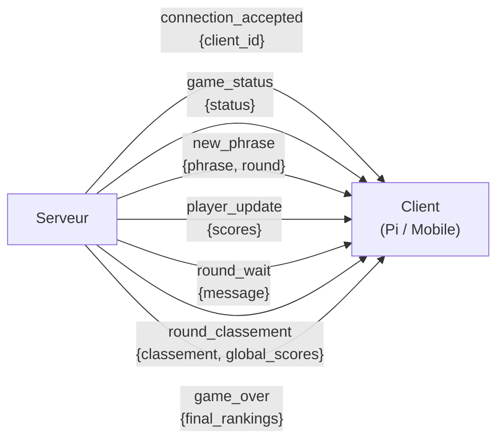

### 4.2 WebSocket — Messages Client → Serveur

| Message | Payload | Description |
|---------|---------|-------------|
| `phrase_finished` | `{time_taken, errors, objects_triggered}` | Joueur a terminé la phrase |

### 4.3 WebSocket — Admin → Serveur

| Commande | Description |
|----------|-------------|
| `start_game` | Démarre la partie |
| `pause_game` / `reset_game` | Pause / réinitialisation |
| `next_round` | Force le round suivant |
| `end_game` | Termine la partie |
| `kick_player` | Expulse un joueur |
| `set_score` / `reset_scores` | Modifie les scores |
| `ia_set_state` / `ia_kick` | Contrôle le bot IA |
| `broadcast_message` | Message à tous |
| `add_phrase` / `delete_phrase` | Gestion des phrases |

### 4.4 MQTT — Topics

| Topic | Direction | Contenu |
|-------|-----------|---------|
| `racetyper/game/console/{player_id}/malus` | Serveur → Pi | Type de malus ciblé |
| `racetyper/game/broadcast` | Serveur → All | Message broadcast |

---

## 5. Flux de jeu complet

### 5.1 Cycle de vie d'une partie

> **Sources :** `2-ServerArbiter/server_app/GameManager.py` (méthodes `start_game`, `process_message`, `force_next_round`), `app.py` (gestion des commandes admin WebSocket)

Ce diagramme d'états modélise les **transitions possibles du statut de partie**, tel que stocké dans `GameManager.game_status`. La valeur de ce champ est persistée en base dans la table `games.status`. La transition `waiting → playing` est déclenchée uniquement par la commande admin `start_game` via WebSocket. Les états `round_wait` et `round_classement` sont internes au `GameManager` — ils ne correspondent pas à une commande admin mais à la réception de `phrase_finished` par tous les joueurs (ou au déclenchement d'un timeout). Le retour automatique de `round_classement` vers `playing` se fait après un délai codé en dur de **3 secondes** dans `GameManager.py`. L'état `game_over` est atteint quand `current_phrase_index` dépasse le nombre total de phrases configurées (5 par défaut).

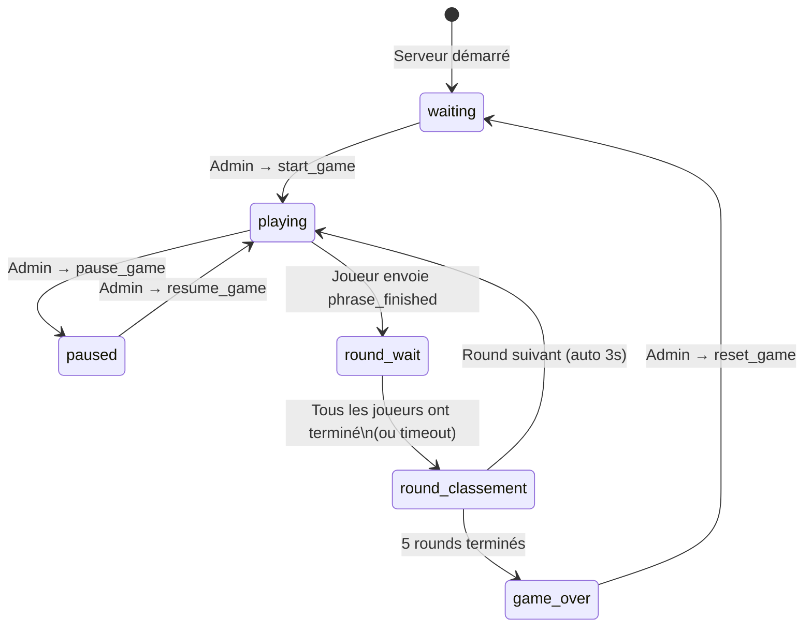

### 5.2 Déroulement d'un round

> **Sources :** `2-ServerArbiter/server_app/GameManager.py` (méthode `process_message`, boucle de round), `models_db.py` (table `RoundResult`), `1-ConsoleRasberry/typing-game-frontend/src/hooks/useTypingGame.ts` (callback de fin de phrase)

Ce diagramme de séquence détaille les **échanges réseau pendant un round**, du lancement admin jusqu'à l'affichage du classement. On voit que le serveur envoie `round_wait` immédiatement au premier joueur qui termine, pour lui indiquer d'attendre les autres. Le message `player_update` est diffusé en broadcast dès qu'un score change — il sert à animer les barres de progression sur tous les clients pendant que les autres joueurs finissent encore. Une fois tous les `phrase_finished` reçus, le serveur insère des enregistrements `RoundResult` en base (un par joueur), calcule le classement et pousse `round_classement`. Après 3 secondes, il envoie automatiquement la `new_phrase` suivante sans action admin requise.

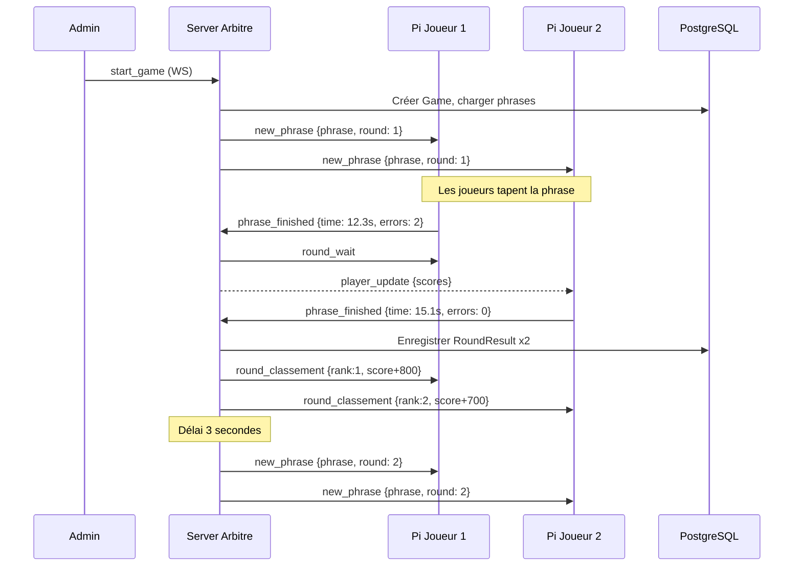

### 5.3 Calcul du score

> **Sources :** `2-ServerArbiter/server_app/GameManager.py` (méthode de calcul de score), `ObjectManager.py` (effets bonus), `1-ConsoleRasberry/typing-game-frontend/src/hooks/useTypingGame.ts` (payload `objects_triggered`)

Ce diagramme simplifie le **système de scoring à trois composantes**. Le score de base est attribué par ordre d'arrivée : 800 points pour le premier à finir, 700 pour le second, etc. — ce barème est défini dans `GameManager.py`. Les bonus sont déclenchés côté client quand le joueur tape un mot marqué `^bonus^` : le frontend l'inclut dans le payload `objects_triggered` du message `phrase_finished`, et le serveur ajoute +100 points par bonus déclaré. Les pénalités (erreurs de frappe) sont aussi remontées dans `errors` du même payload. Le score final est ensuite cumulé au total du joueur et persisté dans `RoundResult.score_added`.

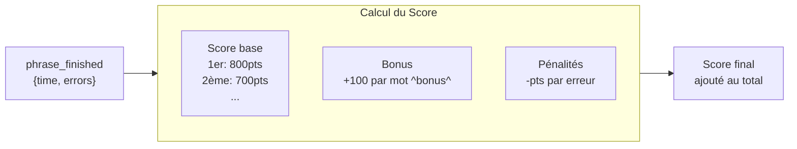

---

## 6. Base de données

### 6.1 Schéma entité-relation

> **Sources :** `2-ServerArbiter/server_app/models_db.py` (modèles SQLAlchemy ORM), `database.py` (création des tables via `init_db()`), `tests/test_main.py` (tests de persistance)

Ce diagramme ERD représente les **5 tables du schéma PostgreSQL** tel que défini dans `models_db.py` avec SQLAlchemy. `Player` identifie chaque console par son `client_id` (ex: `pi-1`) et est créé ou mis à jour à chaque connexion (upsert). `Game` est une session de jeu complète avec son statut et ses timestamps. `Phrase` contient les phrases à taper, ordonnées par `position`. `GamePlayer` est la table de liaison many-to-many entre `Game` et `Player`, avec le score final et le rang. `RoundResult` est la table la plus granulaire : un enregistrement par joueur par round, stockant le temps, les erreurs, le score ajouté et les objets bonus/malus déclenchés en JSONB. C'est depuis `RoundResult` que l'on peut reconstruire l'historique complet d'une partie.

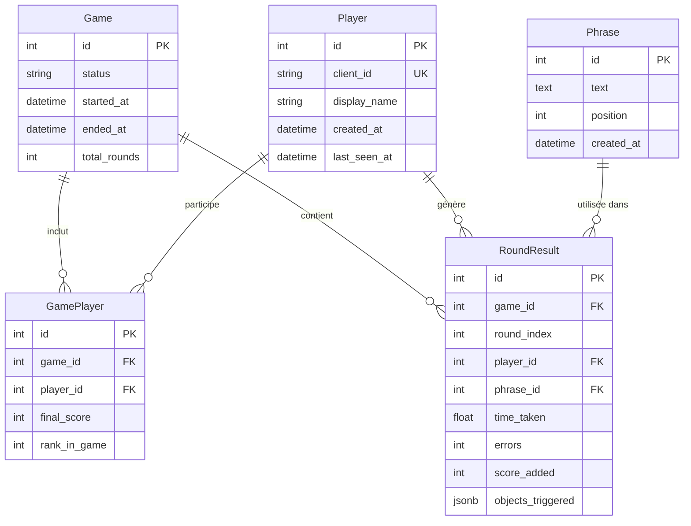

### 6.2 Connexion (dual-mode)

> **Sources :** `2-ServerArbiter/server_app/database.py`, `requirements.txt` (présence des deux drivers : `asyncpg` et `pg8000`), `.env.example`

Ce flowchart documente une **décision de robustesse** présente dans `database.py` : le serveur tente d'abord une connexion via `asyncpg` (driver natif C, performant, requis pour les opérations async). Si `asyncpg` lève une `UnicodeDecodeError` — bug connu sous Windows avec certaines configurations système — il bascule automatiquement sur `pg8000`, un driver PostgreSQL écrit en Python pur qui contourne ce problème. Si les deux échouent, la logique retry tente jusqu'à 5 fois avec un délai de 2 secondes entre chaque essai. Ce mécanisme explique la présence des deux drivers dans `requirements.txt` et le port 5434 (non standard) dans `.env.example` pour éviter les conflits avec une instance PostgreSQL locale.

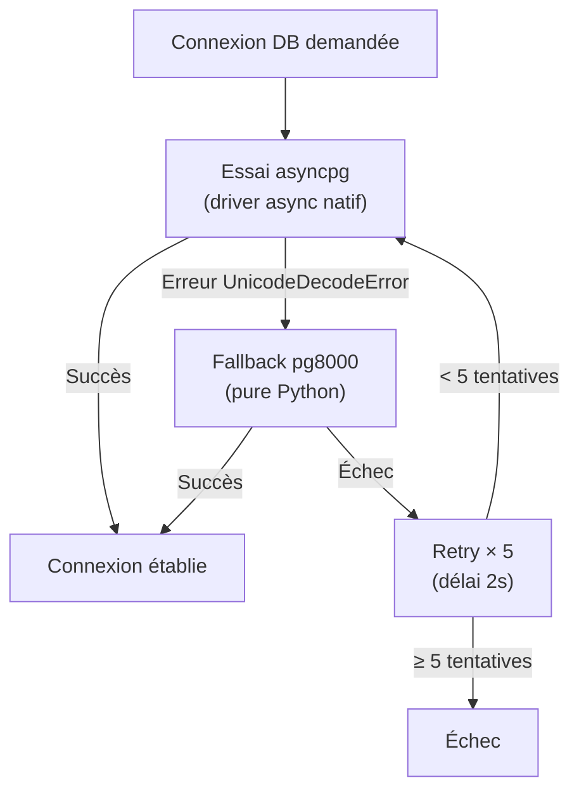

---

## 7. Système Bonus/Malus

### 7.1 Marqueurs dans les phrases

Les phrases peuvent contenir des marqueurs spéciaux :

```
Exemple : "Tape ce ^mot^ mais attention à &piège& ici"
          ^mot^   → bonus word  → effet positif
          &piège& → malus word  → effet négatif
```

### 7.2 Traitement des effets

> **Sources :** `2-ServerArbiter/server_app/ObjectManager.py` (parsing et définition des effets), `GameManager.py` (déclenchement via `process_message`), `1-ConsoleRasberry/gpio-service/malus_handler.py` (routage hardware vs UI), `src/components/MalusOverlay.tsx` et `src/hooks/useTypingGame.ts` (côté client)

Ce flowchart montre le **pipeline complet d'un mot spécial**, de sa détection à son effet. `ObjectManager.parse_phrase()` scanne chaque phrase à la recherche des marqueurs `^..^` (bonus) et `&..&` (malus) ; `get_word_status(phrase, index)` est appelé à chaque mot tapé par le joueur pour lui attribuer son style visuel. Côté bonus, l'effet est purement logiciel : le mot s'affiche en arc-en-ciel dans `TypingDisplay` et +100 points sont ajoutés. Côté malus, les effets se divisent en deux catégories : les effets **hardware** (`TRIGGER_SIREN`) passent par MQTT → GPIO pour déclencher physiquement la sirène ; les effets **visuels/logiciels** (`SCREEN_SHAKE`, `SLEEP`, `SWAPKEY`, `intrusive_gif`, `disable_keyboard`) sont transmis via WebSocket au frontend qui les applique via `MalusOverlay` ou en modifiant le comportement du clavier dans `useTypingGame`.

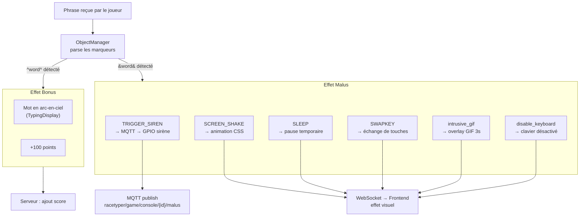

---

## 8. IA (moteur PPO)

### 8.1 Architecture de l'IA

> **Sources :** `3-IAEngine/custom_env.py` (environnement Gymnasium), `train_manager.py` (pipeline d'entraînement PPO), `inference_server.py` (serveur FastAPI d'inférence), `1-ConsoleRasberry/typing-game-frontend/src/hooks/useAIOpponent.ts` (IA locale dans le frontend), `vocab.py` (corpus d'entraînement)

Ce diagramme distingue les **deux modes d'IA** dans le projet. La voie offline : `TypingGameEnv` est un environnement Gymnasium custom où l'observation est l'indice du caractère attendu (espace de 67 caractères couvrant minuscules, majuscules, accents, ponctuation) et l'action est le caractère prédit — l'algorithme PPO reçoit +1 pour un bon caractère, -1 sinon. L'entraînement sur les 70+ phrases de `vocab.py` (dont un extrait du script Bee Movie) produit `ppo_typing_v1.zip`. La voie runtime : `inference_server.py` charge le modèle et expose `POST /predict` que `GameManager` appelle en HTTP pour simuler le bot IA en partie multijoueur. En parallèle, `useAIOpponent.ts` implémente une **IA locale plus simple** (délais fixes + taux d'erreur aléatoire) pour le mode solo sur le Pi, sans requête réseau.

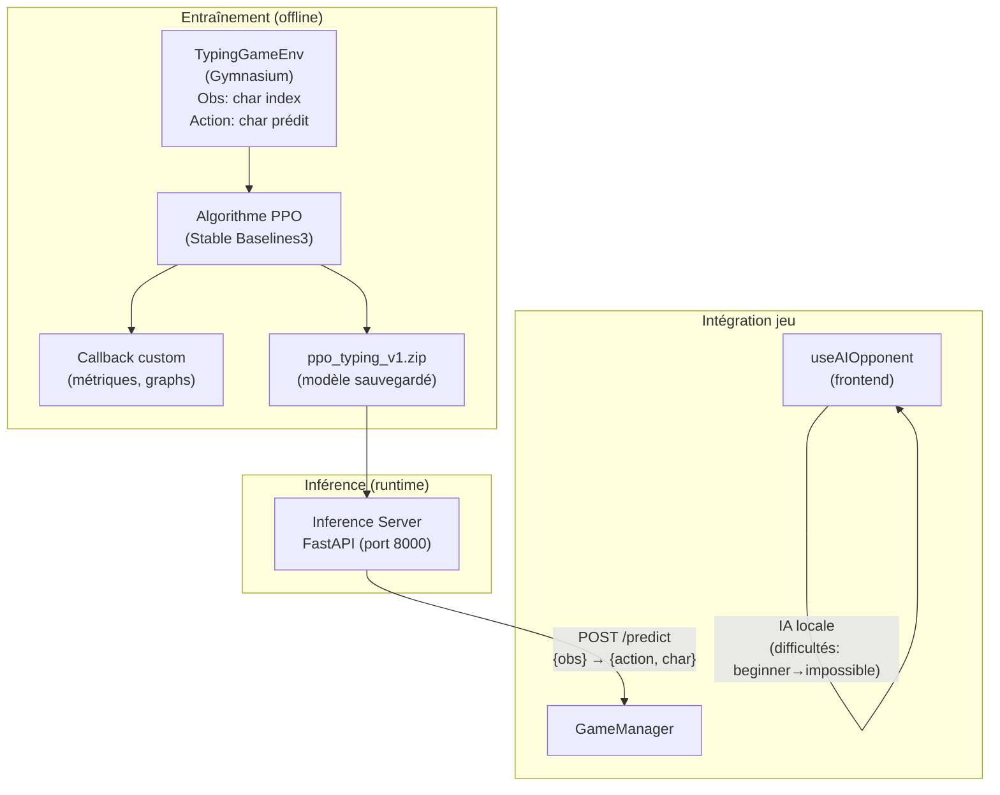

### 8.2 Niveaux de difficulté (IA locale)

| Niveau | Délai | Taux d'erreur | Description |
|--------|-------|---------------|-------------|
| `beginner` | 400ms | 20% | Débutant |
| `intermediate` | 150ms | 8% | Intermédiaire |
| `expert` | 80ms | 5% | Expert |
| `impossible` | 40ms | 2% | Imbattable |
| `debile` | 80ms | 70% | Mode entraînement |

---

## 9. Déploiement

### 9.1 Infrastructure réseau

> **Sources :** `2-ServerArbiter/docker-compose.yml`, `1-ConsoleRasberry/typing-game-frontend/vite.config.ts` (proxy dev), `useServerConnection.ts` (détection auto du serveur via `?server=IP:PORT`), `4-MobileApp/.../SettingsManager.kt` (URL configurable), `FlowDemoComplet.md` (procédure de démo)

Ce diagramme représente l'**infrastructure réseau LAN** attendue en conditions réelles de démo. Tous les équipements sont sur le même réseau local via un routeur (192.168.1.x). Le serveur central héberge trois services distincts : FastAPI sur 8080, PostgreSQL sur 5434, et le broker MQTT sur 1883. Chaque Pi se connecte au serveur via WebSocket en passant son identifiant unique dans l'URL (`/ws/pi-1`, `/ws/pi-2`…). Le frontend détecte automatiquement l'adresse du serveur via le paramètre GET `?server=IP:PORT` — ce qui permet de déployer le même build sur tous les Pi sans modification. L'app Android récupère l'URL depuis `SettingsManager` (DataStore) et peut être reconfigurée depuis l'écran Settings.

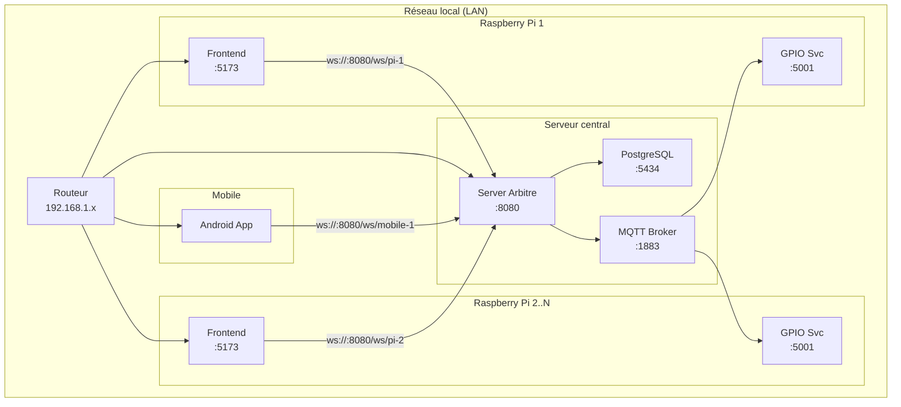

### 9.2 Docker Compose (serveur)

> **Sources :** `2-ServerArbiter/docker-compose.yml`, `Dockerfile`, `.env.example`

Ce diagramme montre la **composition Docker du serveur**. Deux services sont définis : `db` (PostgreSQL 16, exposition du port 5434 vers l'hôte, volume persistant `pgdata`) et `app` (le serveur FastAPI, port 8080, avec `depends_on: db` et un healthcheck pour attendre que PostgreSQL soit prêt avant de lancer `uvicorn`). Le port 5434 (non standard) est un choix délibéré pour éviter les conflits avec une instance PostgreSQL locale sur 5432. La variable `DATABASE_URL` injectée en environnement utilise `asyncpg` comme driver et référence le service `db` par son nom Docker interne (`db:5432`).

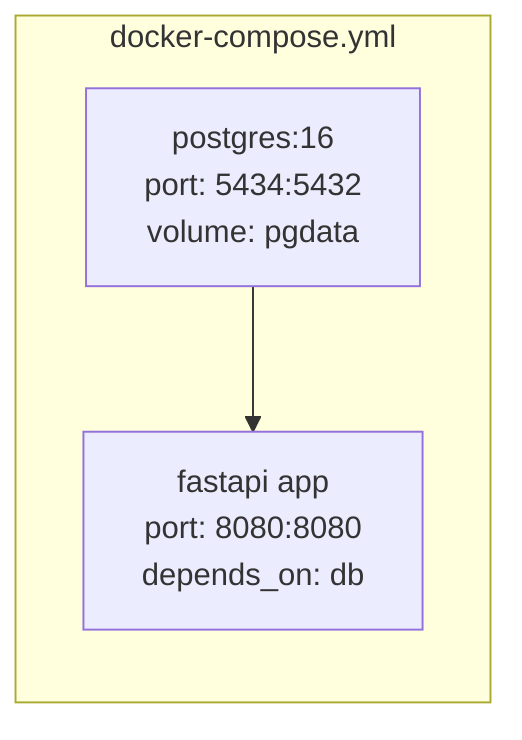

### 9.3 CI/CD Pipeline

> **Sources :** `.github/workflows/ci.yml`, `2-ServerArbiter/tests/test_main.py`, `1-ConsoleRasberry/typing-game-frontend/tsconfig.json`, `package.json`

Ce flowchart représente le **pipeline GitHub Actions** déclenché à chaque `git push`. Les trois jobs s'exécutent en parallèle et sont indépendants. Le job **Server Arbitre** est le plus complet : il démarre un conteneur PostgreSQL 16 en service GitHub Actions (port 5432), installe les dépendances Python et lance `pytest` sur `tests/test_main.py` — ce test couvre la connexion DB, les WebSockets, les routes REST et le cycle de jeu complet. Le job **Console Frontend** exécute `tsc --noEmit` (vérification des types TypeScript sans émission de fichiers) puis `vite build` pour valider que le bundle de production se génère correctement. Le job **GPIO Service** se limite à une vérification syntaxique Python avec `py_compile` car le code GPIO ne peut pas être testé sans matériel Raspberry Pi.

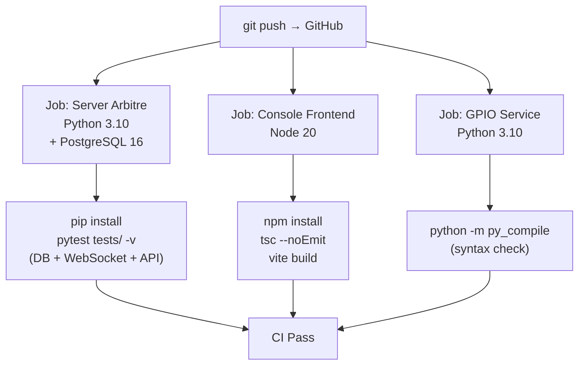

---

## Liens entre composants — Résumé

> **Sources :** synthèse de tous les fichiers du projet — `app.py`, `GameManager.py`, `mqtt_bridge.py`, `malus_handler.py`, `useServerConnection.ts`, `RaceTyperWebSocket.kt`, `inference_server.py`, `docker-compose.yml`

Ce diagramme est la **carte de navigation globale** du projet. Il montre que le **Server Arbitre est le nœud central** : tout transite par lui sauf deux liens directs. L'admin pilote la partie via un WebSocket dédié (`/ws/admin-dashboard`). Les Pi et le mobile sont des clients WebSocket équivalents du point de vue du serveur — la différence est que les Pi envoient des données (frappe) tandis que le mobile est en lecture seule. Le lien MQTT (serveur → broker → GPIO) est le seul chemin **sortant non-WebSocket** du serveur, réservé aux effets physiques ciblés. Le lien HTTP vers l'IA est optionnel : le `GameManager` n'appelle le moteur PPO que quand un bot IA est activé en partie.

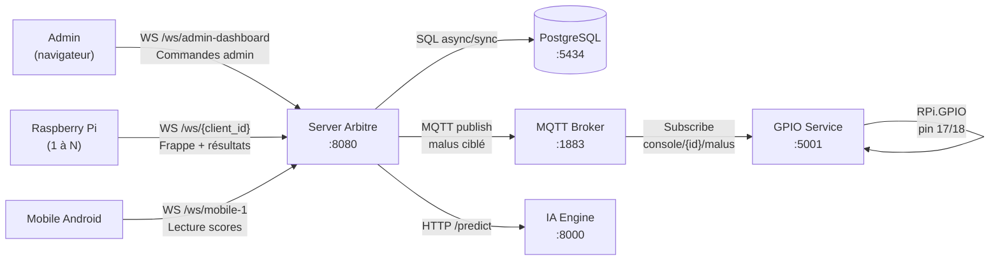

---

*Généré le 2026-03-04 — RaceTyper SAE BUT 3*
