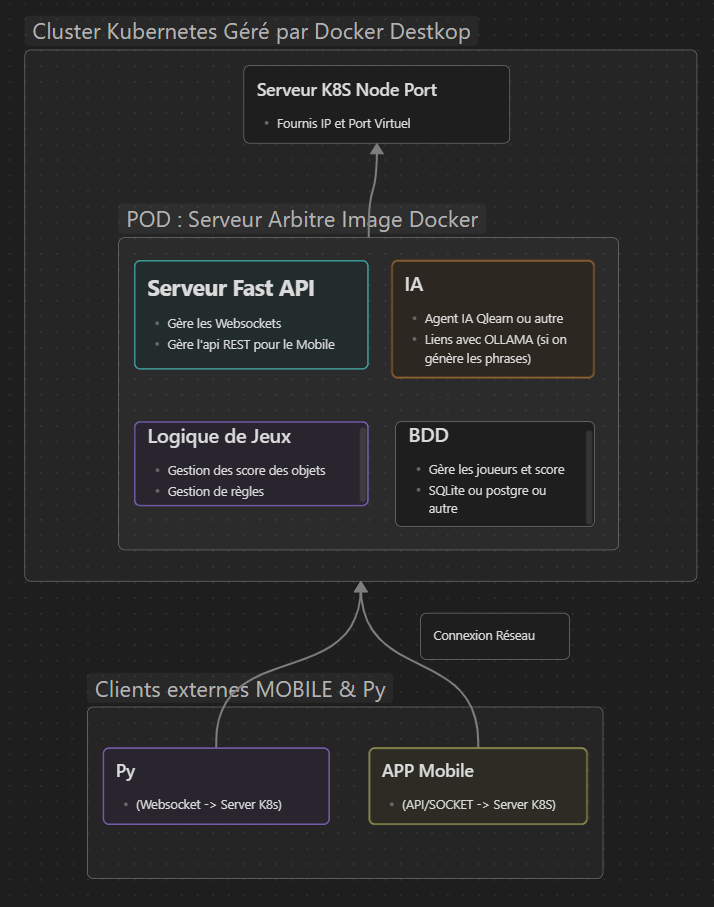

# RaceTyper - Jeu de Course d'Écriture Distribuée
## 🎯 Objectif du Projet
Le projet RaceTyper est un jeu de compétition d'écriture en temps réel conçu pour valider les exigences d'un système distribué et embarqué. Le concept est une course où 3 à 4 joueurs s'affrontent pour taper une phrase le plus rapidement et le plus précisément possible, sous la gestion d'un serveur central intelligent.

Chaque participant utilise un Raspberry Pi  comme console de jeu, et l'architecture est orchestrée par le protocole léger MQTT pour une communication asynchrone et distribuée.

### Gestion du Kubernetes

### ✅ Respect des Contraintes Techniques (SAE BUT 3)

Ce projet est spécifiquement conçu pour répondre à l'intégralité des six contraintes techniques obligatoires du sujet5:ContrainteApplication dans RaceTyperRôle/Technologie1. 

- Le projet doit inclure un service distribué déployé sur un serveur -> Serveur Central + Broker MQTT

- Il doit intégrer au moins un Raspberry Pi dans son architecture -> 3-4 Raspberry Pi comme Consoles de Jeu

- Une base de données doit être hébergée sur l'une des machines du système -> Base de Données sur le Serveur Central

- L'utilisation d'actionneurs est encouragée mais non obligatoire -> LEDs et Sirène (ou voyant) sur chaque Pi

- Le projet doit comprendre le développement d'une application mobile permettant :

- La visualisation des données issues du système et L'interaction avec le serveur -> Application Mobile (Kotlin/Compose) de Visualisation Dynamique

Cette application devra être réalisée en utilisant les technologies vues en cours : Kotlin, Jetpack Compose et coroutines.

Le projet devra intégrer au moins un algorithme d'IA permettant d'effectuer une régression ou une classification.

### 🛠️ Découpage du Travail (150h Total / 50h par personne)
Le travail est divisé en trois pôles principaux avec des responsabilités bien définies :

🧑‍💻 Pôle 1 : Ingénieur Embarqué & Console Pi (50h)
Responsable des Pi (3-4 unités) : Configuration, gestion de l'OS.

Interface de Jeu : Développement de l'interface graphique simple sur l'écran du Pi (affichage de la phrase, progression).

I/O Physique : Câblage et programmation des GPIO pour la détection des entrées clavier et l'activation des LEDs/Sirène (actionneurs).

Communication MQTT : Mise en place du client MQTT Python pour l'envoi des résultats de course.

🧠 Pôle 2 : Architecte Serveur, BDD & Logique de Jeu (50h)
Cœur du Système : Conception de l'API REST et gestion du Broker MQTT.

Logique de Jeu : Distribution synchrone des phrases, chronométrage officiel, calcul des scores et gestion de la logique des objets aléatoires (boosts/malus).

Base de Données : Définition du schéma, gestion des requêtes, stockage des données pour l'IA.

Support IA : Création des structures logicielles pour intégrer l'agent Q-Learning dans la partie.

📱 Pôle 3 : Développeur Mobile (Kotlin/Compose) (50h)
Application Mobile : Développement de l'application en Kotlin, Jetpack Compose et Coroutines.

Visualisation Temps Réel : Affichage du classement dynamique mis à jour via MQTT.

Statistiques : Visualisation des performances des joueurs et des statistiques de l'agent IA (taux de victoire, vitesse moyenne).

Interactions : Implémentation de la fonctionnalité "Démarrer la course" ou "Choisir la difficulté" via l'API du Serveur.